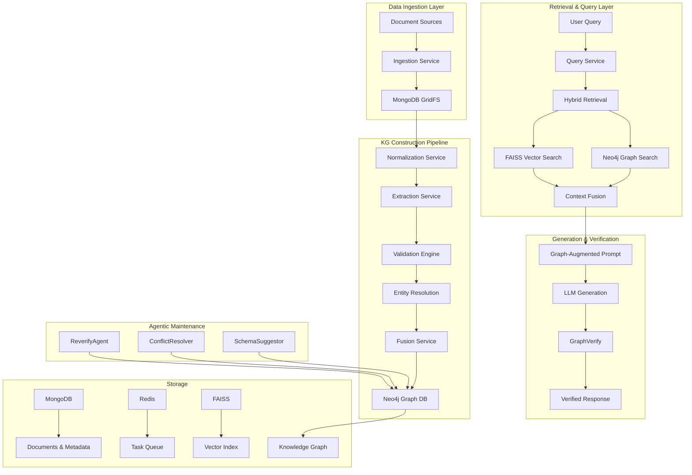
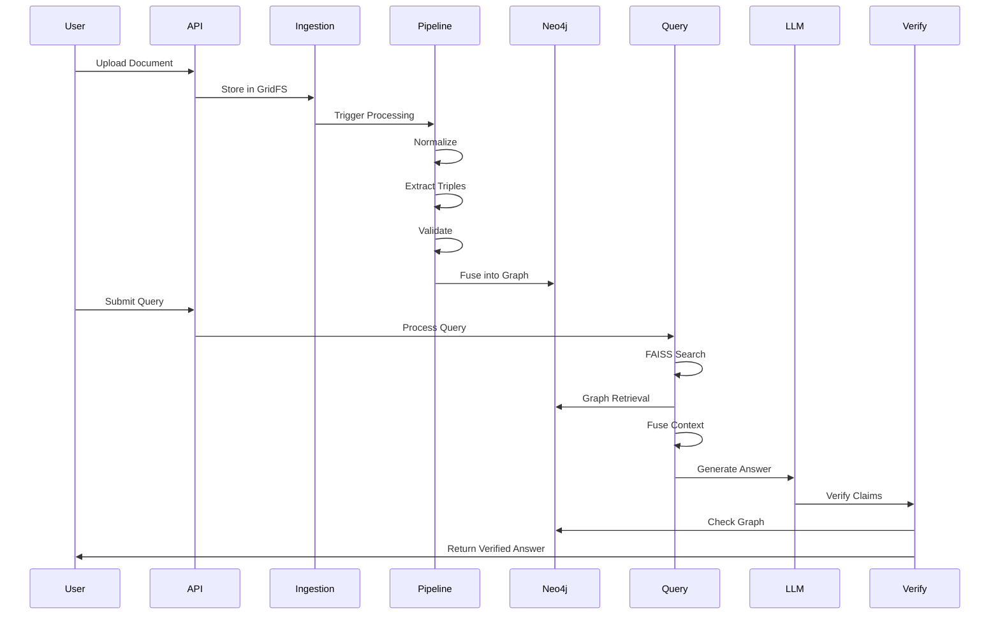
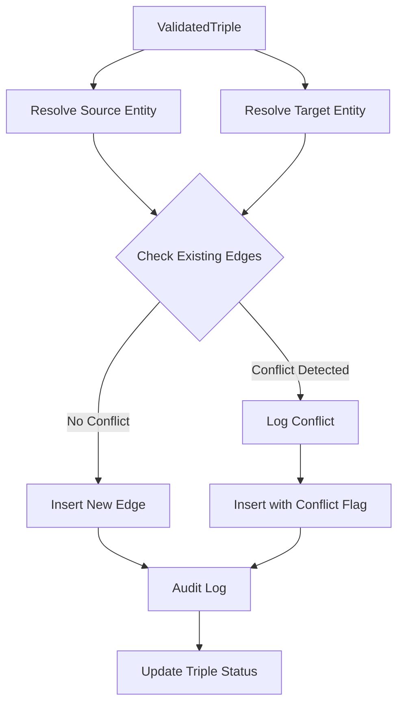
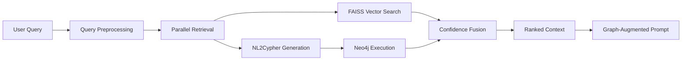

# GraphBuilder-RAG: A Hybrid Knowledge Graph Construction and Retrieval-Augmented Generation Framework for Trustworthy AI

**Workshop Submission for GLOW @ WWW 2026**  
*Graph-enhanced LLMs for Trustworthy Web Data Management*

---

## Executive Summary

GraphBuilder-RAG is a novel framework that addresses critical trustworthiness challenges in Large Language Models (LLMs) through integrated knowledge graph construction, hybrid retrieval, and graph-based verification. The system implements **automated KG extraction and fusion from heterogeneous web/domain data** combined with **update-resilient hybrid KG+RAG pipelines** maintained by autonomous agents.

### Key Innovations

1. **Automated Multi-Stage KG Construction Pipeline**: Heterogeneous data ingestion → normalization → extraction → validation → fusion with provenance tracking
2. **Hybrid Retrieval Architecture**: Combines FAISS vector search + Neo4j graph queries with confidence-based fusion
3. **GraphVerify Module**: Graph-grounded hallucination detection that verifies LLM claims against knowledge graph edges
4. **NL2Cypher Interface**: LLM-powered natural language to Cypher query translation with safety validation
5. **Agentic Maintenance System**: Self-maintaining KG through ReverifyAgent, ConflictResolverAgent, and SchemaSuggestorAgent
6. **End-to-End Provenance**: Evidence spans, source tracking, edge versioning, and confidence scoring throughout

---

## 1. Introduction

### 1.1 Problem Statement

Large Language Models exhibit critical failure modes that undermine their trustworthiness in real-world applications:

- **Hallucination**: Generation of factually incorrect or unsupported claims
- **Missing Relationships**: Inability to reason over structured multi-hop relationships
- **Unverifiable Outputs**: Lack of citations and evidence tracing
- **Knowledge Staleness**: Inability to maintain accuracy as information evolves
- **Opacity**: No explanation of reasoning paths or confidence levels

These limitations prevent deployment in high-stakes domains (medical, legal, financial) where verifiable accuracy is mandatory.

### 1.2 Why Knowledge Graphs?

Knowledge graphs provide:

- **Structural Grounding**: Explicit entity-relationship representations
- **Multi-hop Reasoning**: Traversable relationship paths
- **Verification Substrate**: Ground truth for claim validation
- **Explainability**: Traceable reasoning chains
- **Updateability**: Localized corrections without retraining

### 1.3 Research Objectives

1. **Automated KG Construction**: Build a pipeline that extracts, validates, and fuses knowledge from heterogeneous sources without manual curation
2. **Hybrid Retrieval**: Combine semantic (vector) and structural (graph) retrieval for comprehensive context
3. **Verified Generation**: Ensure LLM outputs are grounded in verified graph knowledge
4. **Provenance Tracking**: Maintain full evidence chains from source documents to final answers
5. **Self-Maintenance**: Deploy agents that keep the KG accurate and consistent over time

---

## 2. GLOW Workshop Alignment

GraphBuilder-RAG directly addresses **5 primary GLOW topics** while implicitly covering all 10:

### Primary Topics (Explicit Contributions)

| GLOW Topic | Our Contribution | System Component |
|------------|------------------|------------------|
| **Topic #6: Automated KG Construction & Validation** | Multi-stage pipeline: ingestion → extraction → validation → fusion | `IngestionService`, `ExtractionService`, `ValidationEngine`, `FusionService` |
| **Topic #7: Graph-Based Prompting + RAG** | Hybrid retrieval with graph-augmented prompt building | `HybridRetrievalService`, `QueryService` |
| **Topic #2: Hallucination Detection & Mitigation** | GraphVerify module for claim verification | `GraphVerifyEngine` |
| **Topic #5: NL2Cypher Interface** | LLM-powered natural language → Cypher translation | `NL2QueryEngine` in `QueryService` |
| **Topic #3: Explainability & Provenance** | Evidence spans, source tracking, confidence scores | `EvidenceSpan`, edge versioning, audit logs |

### Implicit Topics (Covered by Design)

- **Topic #1**: Graph-based retrieval via Neo4j subgraph traversal
- **Topic #4**: Property graphs with rich node/edge properties and versioning
- **Topic #8**: Trustworthiness metrics (confidence, fairness, provenance completeness)
- **Topic #9**: Domain-agnostic architecture applicable to medical, finance, legal domains
- **Topic #10**: Agentic AI through ReverifyAgent, ConflictResolverAgent, SchemaSuggestorAgent

### Mentor's Two Core Requirements

✅ **Requirement 1: Automated KG extraction & fusion from heterogeneous Web/domain data**

Implemented via:
- Multi-source ingestion (URLs, files, APIs)
- Normalization layer for format unification
- Dual extraction (table-based + LLM-based)
- Multi-validator pipeline (ontology + domain + external)
- Entity resolution and idempotent fusion

✅ **Requirement 2: Hybrid KG + RAG + Update-resilient pipelines**

Implemented via:
- FAISS vector index for semantic search
- Neo4j graph database for structural retrieval
- Confidence-based fusion of retrieval signals
- Autonomous agents (ReverifyAgent, ConflictResolverAgent) for continuous validation
- Versioned edges with conflict detection

---

## 3. System Architecture

### 3.1 High-Level Architecture



### 3.2 Data Flow: Document Ingestion → Query Response



### 3.3 Technology Stack

| Layer | Technology | Purpose |
|-------|-----------|---------|
| **API** | FastAPI | RESTful endpoints for ingestion and query |
| **Graph DB** | Neo4j | Property graph storage with Cypher queries |
| **Document DB** | MongoDB + GridFS | Raw documents, metadata, audit logs |
| **Vector Store** | FAISS | Dense embeddings for semantic search |
| **Cache** | Redis | Task queue, session management |
| **Workers** | Celery | Asynchronous processing, agent orchestration |
| **LLM** | Groq (Llama 3.3 70B) | Extraction, NL2Cypher, QA, verification |
| **Embeddings** | SentenceTransformers | all-MiniLM-L6-v2 for text encoding |

---

## 4. Core System Components

### 4.1 Document Ingestion Service

**Purpose**: Unified entry point for heterogeneous data sources

**Functionality**:
- **Multi-source Support**: URLs, file uploads, API endpoints
- **Format Detection**: Automatic detection of PDF, HTML, JSON, CSV, etc.
- **Content Hashing**: SHA-256 deduplication
- **GridFS Storage**: Large binary storage in MongoDB
- **Metadata Creation**: Document ID generation, timestamps, source tracking

**Key Implementation**:
```python
async def ingest_from_url(url: str, source_type: DocumentType) -> RawDocument:
    # Fetch document
    content = await http_client.get(url)
    
    # Generate hash for deduplication
    content_hash = sha256(content).hexdigest()
    
    # Check for duplicates
    if exists := await collection.find_one({"content_hash": content_hash}):
        return existing_document
    
    # Store in GridFS
    gridfs_id = await gridfs.upload(content)
    
    # Create metadata record
    raw_doc = RawDocument(
        document_id=generate_id(),
        source=url,
        content_hash=content_hash,
        gridfs_id=gridfs_id,
        timestamp=utcnow()
    )
    
    # Emit normalization task
    await emit_task("normalize_document", doc_id=raw_doc.document_id)
    
    return raw_doc
```

**GLOW Alignment**: Foundation for Topic #6 (Automated KG Construction)

---

### 4.2 Normalization Service

**Purpose**: Convert heterogeneous formats into unified structured representation

**Functionality**:
- **PDF Extraction**: Text + layout analysis using PyMuPDF
- **HTML Parsing**: Clean extraction with BeautifulSoup
- **Table Detection**: Identify and structure tabular data
- **Chunking**: Split into semantically coherent segments
- **Metadata Preservation**: Maintain section headers, page numbers, table IDs

**Normalization Output**:
```json
{
  "document_id": "doc_abc123",
  "text_chunks": [
    {
      "chunk_id": "chunk_001",
      "text": "Albert Einstein was born in Ulm, Germany...",
      "start_char": 0,
      "end_char": 156,
      "metadata": {"section": "Biography", "page": 1}
    }
  ],
  "tables": [
    {
      "table_id": "table_001",
      "headers": ["Name", "Born", "Died"],
      "rows": [["Albert Einstein", "1879", "1955"]]
    }
  ]
}
```

**GLOW Alignment**: Enables extraction from diverse sources (Topic #6)

---

### 4.3 Extraction Service

**Purpose**: Extract knowledge triples (subject, predicate, object) from normalized documents

**Dual Extraction Strategy**:

#### 4.3.1 Table Extractor (Deterministic)
- **Input**: Structured tables
- **Method**: Rule-based column mapping
- **Confidence**: 0.95 (high reliability)
- **Example**:
  ```
  Table: | Person | Born | Died |
         | Einstein | 1879 | 1955 |
  
  Extracts:
  - (Einstein, born_year, 1879)
  - (Einstein, died_year, 1955)
  ```

#### 4.3.2 LLM Extractor (Semantic)
- **Input**: Unstructured text chunks
- **Method**: Groq LLM with structured prompt
- **Output**: JSON array of triples with evidence spans
- **Confidence**: Model-generated + heuristics

**LLM Extraction Prompt**:
```
Extract all factual relationships from this text as triples.

TEXT:
Albert Einstein was born in Ulm, Germany on March 14, 1879.

FORMAT (JSON):
[
  {
    "subject": "Albert Einstein",
    "predicate": "born_in",
    "object": "Ulm, Germany",
    "subject_type": "Person",
    "object_type": "Location",
    "evidence_span": {"start": 0, "end": 56}
  }
]
```

**Output**: `CandidateTriple` objects with evidence spans

**GLOW Alignment**: Core of Topic #6 (Automated KG Construction)

---

### 4.4 Validation Engine

**Purpose**: Validate candidate triples before graph fusion

**Multi-Validator Pipeline**:

#### 4.4.1 Ontology Validator
- **Type Constraints**: Check subject/object types match predicate expectations
- **Example**: `founded_by` requires `(Organization, founded_by, Person)`
- **Domain Rules**: Numeric ranges, date formats, cardinality constraints

#### 4.4.2 Domain Constraint Validator
- **Sanity Checks**: Non-empty fields, no self-loops, reasonable lengths
- **Evidence Quality**: Verify evidence spans exist and are non-trivial
- **Logical Consistency**: No obvious contradictions

#### 4.4.3 External Verifier
- **Wikipedia API**: Cross-check entities and relationships
- **Wikidata SPARQL**: Query for confirming triples
- **Caching**: Avoid redundant API calls
- **Confidence Boosting**: +0.2 confidence if externally verified

**Confidence Fusion**:
```python
final_confidence = (
    extraction_confidence * 0.4 +
    ontology_score * 0.2 +
    domain_score * 0.2 +
    external_score * 0.2
)
```

**Validation Result**:
```python
ValidatedTriple(
    triple_id="triple_xyz",
    triple=Triple(...),
    validation=ValidationResult(
        passed=True,
        confidence_score=0.87,
        checks_passed=["ontology", "domain", "external"],
        external_sources=["wikipedia", "wikidata"]
    ),
    evidence=[EvidenceSpan(...)]
)
```

**GLOW Alignment**: Ensures trustworthiness (Topic #6, Topic #8)

---

### 4.5 Entity Resolution Service

**Purpose**: Map entity mentions to canonical entity IDs to avoid duplicates

**Resolution Strategy**:
1. **Exact Match**: Check for exact canonical_name match
2. **Alias Match**: Check against known aliases
3. **Fuzzy Match**: Levenshtein distance with threshold
4. **Create New**: If no match, create new canonical entity

**Entity Record**:
```python
Entity(
    entity_id="ent_einstein_001",
    canonical_name="Albert Einstein",
    aliases=["Einstein", "A. Einstein"],
    entity_type=EntityType.PERSON,
    confidence=0.95
)
```

**GLOW Alignment**: Enables entity linking and deduplication (Topic #4, Topic #6)

---

### 4.6 Fusion Service

**Purpose**: Upsert validated triples into Neo4j with versioning and conflict detection

**Fusion Workflow**:



**Edge Versioning**:
- Each edge has a `version` property
- Updates increment version
- Old versions retained in audit logs
- Conflicts detected when same (source, relationship) maps to different targets

**Neo4j Schema**:
```cypher
CREATE (s:Entity {
    entity_id: "ent_001",
    canonical_name: "Albert Einstein",
    entity_type: "Person"
})

CREATE (t:Entity {
    entity_id: "ent_002", 
    canonical_name: "Ulm, Germany",
    entity_type: "Location"
})

CREATE (s)-[r:BORN_IN {
    edge_id: "edge_abc",
    confidence: 0.87,
    evidence_ids: ["doc_001"],
    version: 1,
    timestamp: "2025-12-08T10:00:00Z"
}]->(t)
```

**GLOW Alignment**: Update-resilient KG (Mentor Requirement #2, Topic #4)

---

## 5. Hybrid Retrieval Architecture

### 5.1 Overview

GraphBuilder-RAG implements a **confidence-based hybrid retrieval** system that combines:
- **Semantic Retrieval**: FAISS vector similarity search
- **Structural Retrieval**: Neo4j graph traversal with NL2Cypher

### 5.2 Retrieval Flow



### 5.3 FAISS Vector Search

**Implementation**:
1. **Query Encoding**: Embed query using SentenceTransformer
2. **Index Search**: L2 distance search in FAISS index
3. **Chunk Retrieval**: Fetch top-k chunks from MongoDB
4. **Score Normalization**: Convert distances to similarity scores

**Chunk Match**:
```python
ChunkMatch(
    chunk_id="chunk_001",
    document_id="doc_abc",
    text="Albert Einstein was born...",
    score=0.89,  # Cosine similarity
    metadata={"section": "Biography"}
)
```

---

**[Continue to Part 2 for remaining sections...]**
