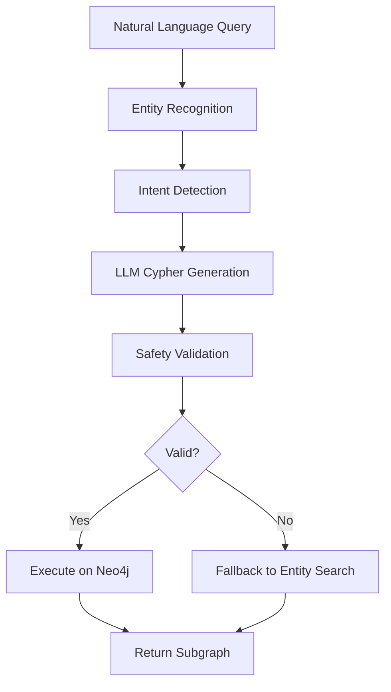
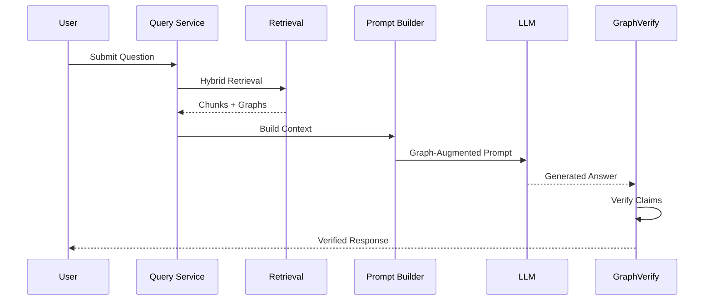
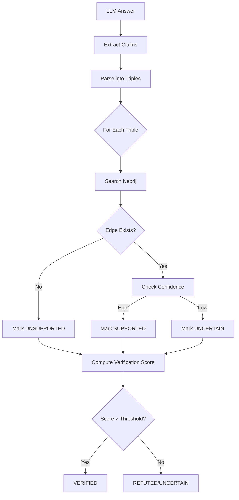
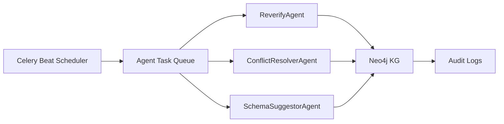

# GraphBuilder-RAG Documentation - Part 2

## 5.4 NL2Cypher: Natural Language to Graph Query Translation

**Purpose**: Convert natural language questions into executable Cypher queries

**Why NL2Cypher?**
- Enables non-technical users to query knowledge graphs
- Leverages graph structure for precise multi-hop reasoning
- Provides explainable query logic
- Reduces hallucination by constraining retrieval to graph facts

### 5.4.1 NL2Cypher Generation Pipeline



### 5.4.2 LLM-Powered Cypher Generation

**System Prompt**:
```
You are a Neo4j Cypher query generator. Convert natural language 
questions into precise Cypher queries.

GRAPH SCHEMA:
- Nodes: Entity(entity_id, canonical_name, entity_type, aliases)
- Relationships: All relationships have (edge_id, confidence, evidence_ids, version)

SAFETY RULES:
1. Use MATCH, not CREATE/DELETE
2. Always use LIMIT to prevent large returns
3. Use parameters for user inputs
4. Return only necessary properties
```

**Example Generation**:
```
Question: "Where was Albert Einstein born?"

Generated Cypher:
MATCH (person:Entity {canonical_name: $person_name})-[r:BORN_IN]->(place:Entity)
WHERE person.entity_type = 'Person'
RETURN person.canonical_name, place.canonical_name, r.confidence
LIMIT 1

Parameters: {"person_name": "Albert Einstein"}

Explanation: "Finding birthplace relationship for person Albert Einstein"
```

### 5.4.3 Safety Validation

Before executing generated Cypher:
1. **Syntax Check**: Parse query for valid Cypher syntax
2. **Read-Only Enforcement**: Block CREATE, DELETE, SET, REMOVE, MERGE
3. **Limit Enforcement**: Ensure LIMIT clause exists and is reasonable
4. **Parameter Binding**: Prevent injection via parameterization
5. **Timeout Protection**: Set query timeout (5 seconds)

**Implementation**:
```python
async def _generate_cypher_query(question: str, domain: str) -> dict:
    # Extract entities for context
    entities = self._extract_entities_simple(question)
    
    # Format prompt
    user_prompt = format_nl2cypher_prompt(
        question=question,
        domain=domain,
        entities=entities
    )
    
    # Call LLM with low temperature for precision
    result = await groq.generate_cypher(
        question=question,
        system_prompt=NL2CYPHER_SYSTEM_PROMPT,
        user_prompt=user_prompt,
        temperature=0.1,
        max_tokens=1024
    )
    
    # Validate safety
    if not self._validate_cypher_safety(result["cypher"]):
        raise UnsafeCypherError("Generated query violates safety rules")
    
    return result
```

### 5.4.4 Fallback Strategy

If NL2Cypher fails (invalid query, empty results, safety violation):
1. **Extract Entities**: Simple regex/heuristic entity extraction
2. **Entity Resolution**: Map to entity IDs in Neo4j
3. **Subgraph Retrieval**: Traverse k-hop neighborhood
4. **Return Subgraph**: Use as graph context for LLM

**GLOW Alignment**: Topic #5 (NL2Cypher Interface), Topic #7 (Graph-based RAG)

---

## 5.5 Confidence-Based Fusion

**Purpose**: Combine semantic and structural retrieval signals into unified context

**Fusion Algorithm**:
```python
def fuse_retrieval_results(
    chunks: List[ChunkMatch],
    graphs: List[GraphMatch],
    semantic_weight: float = 0.6,
    graph_weight: float = 0.4
) -> HybridRetrievalResult:
    
    # Compute average scores
    avg_chunk_score = mean([c.score for c in chunks]) if chunks else 0
    avg_graph_score = mean([g.relevance_score for g in graphs]) if graphs else 0
    
    # Weighted combination
    combined_score = (
        semantic_weight * avg_chunk_score +
        graph_weight * avg_graph_score
    )
    
    return HybridRetrievalResult(
        chunks=chunks,
        graphs=graphs,
        combined_score=combined_score,
        retrieval_metadata={
            "nl2cypher_used": bool(cypher_result),
            "num_chunks": len(chunks),
            "num_graph_nodes": sum(g.node_count for g in graphs),
            "num_graph_edges": sum(g.edge_count for g in graphs)
        }
    )
```

**Context Ranking**:
- Sort chunks by similarity score
- Sort graph matches by relevance
- Take top-k from each
- Provide both to prompt builder

---

## 6. Query Service & Graph-Augmented Prompting

### 6.1 Query Processing Workflow



### 6.2 Graph-Augmented Prompt Building

**Purpose**: Inject structured graph context into LLM prompts for grounded generation

**Prompt Structure**:
```
SYSTEM: You are a knowledge assistant. Answer questions using 
ONLY the provided context. If uncertain, say so.

CONTEXT FROM TEXT CHUNKS:
---
Chunk 1 (Score: 0.89):
Albert Einstein was born in Ulm, Germany on March 14, 1879. He later...

Chunk 2 (Score: 0.85):
Einstein's contributions to physics include the theory of relativity...
---

CONTEXT FROM KNOWLEDGE GRAPH:
---
Graph Facts:
- (Albert Einstein, born_in, Ulm, Germany) [confidence: 0.95]
- (Albert Einstein, born_on, 1879-03-14) [confidence: 0.98]
- (Albert Einstein, nationality, German) [confidence: 0.92]

Graph Relationships (multi-hop):
Albert Einstein -[born_in]-> Ulm, Germany -[located_in]-> Baden-Württemberg
---

QUESTION: Where and when was Albert Einstein born?

INSTRUCTIONS:
1. Answer using ONLY facts from the context above
2. Cite evidence from text chunks or graph facts
3. If graph and text conflict, prefer higher confidence source
4. If no relevant context, respond "Insufficient information"

ANSWER:
```

**Key Features**:
- **Dual Context**: Text chunks + graph facts
- **Confidence Display**: Show confidence scores for transparency
- **Multi-hop Display**: Show graph paths for reasoning
- **Grounding Constraint**: Instruct to use only provided context
- **Conflict Resolution**: Prefer higher confidence sources

### 6.3 LLM Generation

**Configuration**:
- **Model**: Groq Llama 3.3 70B Versatile
- **Temperature**: 0.1 (low for factual accuracy)
- **Max Tokens**: 1024
- **Top-p**: 0.9
- **Stop Sequences**: None (let model complete naturally)

**Implementation**:
```python
async def generate_answer(prompt: str) -> str:
    response = await groq.chat_completion(
        messages=[
            {"role": "system", "content": QA_SYSTEM_PROMPT},
            {"role": "user", "content": prompt}
        ],
        temperature=0.1,
        max_tokens=1024
    )
    return response.choices[0].message.content
```

**GLOW Alignment**: Topic #7 (Graph-based Prompting for RAG)

---

## 7. GraphVerify: Hallucination Detection Module

### 7.1 Overview

**Purpose**: Verify LLM-generated answers against knowledge graph to detect hallucinations

**Why Graph-Based Verification?**
- LLMs hallucinate plausible but false facts
- Knowledge graphs provide ground truth
- Graph edges have confidence scores and evidence
- Verification is deterministic and explainable

### 7.2 Verification Workflow



### 7.3 Claim Extraction

**LLM-Based Claim Parsing**:
```
SYSTEM: Extract all factual claims from the answer as triples.

ANSWER:
Albert Einstein was born in Ulm, Germany on March 14, 1879.

OUTPUT (JSON):
[
  {
    "subject": "Albert Einstein",
    "predicate": "born_in",
    "object": "Ulm, Germany"
  },
  {
    "subject": "Albert Einstein",
    "predicate": "birth_date",
    "object": "1879-03-14"
  }
]
```

### 7.4 Graph-Based Verification

**For Each Claim**:
1. **Normalize**: Convert to canonical form (lowercase, stemming)
2. **Cypher Query**:
   ```cypher
   MATCH (s:Entity)-[r]->(o:Entity)
   WHERE s.canonical_name = $subject
     AND type(r) IN $predicates
     AND o.canonical_name = $object
   RETURN r.confidence, r.evidence_ids
   ```
3. **Evaluate**:
   - **SUPPORTED**: Edge exists with confidence ≥ 0.7
   - **UNSUPPORTED**: No matching edge found
   - **CONTRADICTED**: Conflicting edge exists
   - **UNCERTAIN**: Edge exists with confidence < 0.7

### 7.5 Verification Status Calculation

```python
def compute_verification_status(claims: List[VerifiedClaim]) -> VerificationStatus:
    supported = sum(1 for c in claims if c.status == "SUPPORTED")
    total = len(claims)
    
    support_ratio = supported / total if total > 0 else 0
    
    if support_ratio >= 0.9:
        return VerificationStatus.VERIFIED
    elif support_ratio >= 0.7:
        return VerificationStatus.PARTIALLY_VERIFIED
    elif any(c.status == "CONTRADICTED" for c in claims):
        return VerificationStatus.REFUTED
    else:
        return VerificationStatus.UNVERIFIABLE
```

### 7.6 Response Enrichment

**Verified Response**:
```json
{
  "answer": "Albert Einstein was born in Ulm, Germany on March 14, 1879.",
  "verification": {
    "status": "VERIFIED",
    "confidence": 0.95,
    "claims": [
      {
        "claim": "(Albert Einstein, born_in, Ulm, Germany)",
        "status": "SUPPORTED",
        "evidence_ids": ["doc_001", "doc_005"],
        "graph_confidence": 0.95
      },
      {
        "claim": "(Albert Einstein, birth_date, 1879-03-14)",
        "status": "SUPPORTED",
        "evidence_ids": ["doc_001"],
        "graph_confidence": 0.98
      }
    ]
  },
  "sources": [
    {"doc_id": "doc_001", "title": "Einstein Biography"},
    {"doc_id": "doc_005", "title": "Notable Scientists Born in Germany"}
  ]
}
```

**GLOW Alignment**: Topic #2 (Hallucination Detection), Topic #3 (Provenance)

---

## 8. Agentic Maintenance System

### 8.1 Overview

**Purpose**: Autonomous agents that maintain KG accuracy and consistency over time

**Why Agents?**
- Knowledge evolves (new facts, corrections, conflicts)
- Manual maintenance doesn't scale
- Agents provide continuous monitoring
- Update-resilient architecture (Mentor Requirement #2)

### 8.2 Agent Architecture



### 8.3 ReverifyAgent

**Purpose**: Periodically re-validate triples using external sources

**Workflow**:
1. **Query**: Find triples not verified in last 7 days
2. **Reverify**: Call Wikipedia/Wikidata APIs
3. **Update Confidence**: Adjust based on new evidence
4. **Flag Issues**: Mark triples with declining confidence
5. **Audit**: Log all reverification actions

**Implementation**:
```python
class ReverifyAgent(BaseAgent):
    async def run_cycle(self) -> Dict:
        cutoff = datetime.utcnow() - timedelta(days=7)
        
        # Find stale triples
        triples = await self.mongodb.validated_triples.find({
            "last_verified": {"$lt": cutoff},
            "validation.confidence": {"$gte": 0.6}
        }).limit(100).to_list()
        
        reverified = 0
        confidence_updates = []
        
        for triple in triples:
            # Reverify with external sources
            result = await external_verifier.verify(triple)
            
            new_confidence = compute_updated_confidence(
                old=triple.validation.confidence,
                new=result.confidence
            )
            
            # Update if significant change
            if abs(new_confidence - triple.validation.confidence) > 0.1:
                await self.update_triple_confidence(
                    triple.triple_id,
                    new_confidence
                )
                confidence_updates.append({
                    "triple_id": triple.triple_id,
                    "old": triple.validation.confidence,
                    "new": new_confidence
                })
            
            reverified += 1
        
        return {
            "triples_reverified": reverified,
            "confidence_updates": len(confidence_updates)
        }
```

**Scheduling**: Runs every 6 hours via Celery Beat

### 8.4 ConflictResolverAgent

**Purpose**: Detect and resolve contradictory edges in the knowledge graph

**Conflict Types**:
1. **Functional Conflict**: Same (source, predicate) with different objects
   - Example: `(Einstein, born_in, Ulm)` vs `(Einstein, born_in, Munich)`
2. **Temporal Conflict**: Contradictory time-dependent facts
   - Example: `(Company X, CEO, Person A)` and `(Company X, CEO, Person B)` simultaneously
3. **Type Conflict**: Incompatible entity types
   - Example: Entity classified as both `Person` and `Organization`

**Resolution Strategy**:
```python
async def resolve_conflict(conflict: ConflictRecord) -> Resolution:
    edges = conflict.conflicting_edges
    
    # Strategy 1: Confidence-based
    highest_confidence = max(edges, key=lambda e: e.confidence)
    if highest_confidence.confidence > 0.85:
        return Resolution(
            action="keep_highest_confidence",
            selected_edge=highest_confidence
        )
    
    # Strategy 2: Evidence count
    most_evidence = max(edges, key=lambda e: len(e.evidence_ids))
    if len(most_evidence.evidence_ids) > 3:
        return Resolution(
            action="keep_most_evidence",
            selected_edge=most_evidence
        )
    
    # Strategy 3: Recency (for temporal conflicts)
    most_recent = max(edges, key=lambda e: e.timestamp)
    if conflict.type == "temporal":
        return Resolution(
            action="keep_most_recent",
            selected_edge=most_recent
        )
    
    # Strategy 4: Flag for human review
    return Resolution(
        action="flag_for_review",
        reason="Cannot automatically resolve conflict"
    )
```

**Scheduling**: Runs daily at 2:00 AM

### 8.5 SchemaSuggestorAgent

**Purpose**: Detect ontology gaps and suggest schema extensions

**Detection Methods**:
1. **Frequent Predicate Patterns**: Discover new relationship types
2. **Entity Type Clustering**: Identify new entity categories
3. **Property Analysis**: Suggest missing entity/edge properties

**Example**:
```python
async def suggest_schema_extensions(self) -> List[Suggestion]:
    # Find frequent predicates not in schema
    predicates = await self.neo4j.execute("""
        MATCH ()-[r]->()
        RETURN type(r) as predicate, count(*) as frequency
        ORDER BY frequency DESC
        LIMIT 50
    """)
    
    suggestions = []
    for pred in predicates:
        if pred["predicate"] not in self.known_predicates:
            suggestions.append(Suggestion(
                type="new_relationship_type",
                name=pred["predicate"],
                frequency=pred["frequency"],
                confidence=0.8 if pred["frequency"] > 100 else 0.6
            ))
    
    return suggestions
```

**Scheduling**: Runs weekly

**GLOW Alignment**: Topic #10 (Agentic AI), Mentor Requirement #2 (Update-resilient)

---

## 9. Provenance & Explainability

### 9.1 End-to-End Evidence Tracking

**Evidence Chain**:
```
Source Document → Text Span → Extracted Triple → Validated Triple → Graph Edge → LLM Answer
```

**EvidenceSpan Schema**:
```python
class EvidenceSpan(BaseModel):
    document_id: str
    start_char: int
    end_char: int
    text: str
    confidence: float = 1.0
    table_id: Optional[str] = None  # If from table
```

**Graph Edge with Evidence**:
```cypher
CREATE (s)-[r:BORN_IN {
    edge_id: "edge_123",
    confidence: 0.95,
    evidence_ids: ["doc_001", "doc_005"],
    version: 1,
    timestamp: "2025-12-08T10:00:00Z",
    source_spans: [
        {"doc": "doc_001", "start": 45, "end": 89},
        {"doc": "doc_005", "start": 120, "end": 156}
    ]
}]->(t)
```

### 9.2 Audit Logging

**UpsertAudit Collection**:
```json
{
  "audit_id": "audit_xyz",
  "edge_id": "edge_123",
  "operation": "update",
  "previous_version": 1,
  "new_version": 2,
  "changes": {
    "confidence": {"old": 0.85, "new": 0.95},
    "evidence_ids": {"added": ["doc_010"]}
  },
  "conflict_detected": false,
  "timestamp": "2025-12-08T12:00:00Z",
  "agent": "ReverifyAgent"
}
```

### 9.3 Explainable Responses

**User-Facing Explanation**:
```json
{
  "answer": "Albert Einstein was born in Ulm, Germany.",
  "reasoning": {
    "retrieval": {
      "semantic_chunks": 3,
      "graph_nodes": 5,
      "graph_edges": 4
    },
    "verification": {
      "claims_verified": 2,
      "claims_supported": 2,
      "support_ratio": 1.0
    },
    "evidence_chain": [
      {
        "claim": "(Einstein, born_in, Ulm)",
        "graph_edge": "edge_123",
        "confidence": 0.95,
        "sources": [
          {
            "doc_id": "doc_001",
            "title": "Einstein Biography",
            "excerpt": "...born in Ulm, Germany on March 14, 1879..."
          }
        ]
      }
    ]
  }
}
```

**GLOW Alignment**: Topic #3 (Explainability & Provenance), Topic #8 (Trustworthiness)

---

## 10. Design Decisions & Rationale

### 10.1 Property Graphs (Neo4j) vs RDF

**Why Neo4j?**
- **Rich Properties**: Edges can store confidence, evidence, versions
- **Performance**: Fast traversal for multi-hop queries
- **Flexibility**: Schema-optional for rapid iteration
- **Cypher**: Intuitive query language for NL2Cypher
- **Versioning**: Native support for temporal graphs

**RDF Limitations**:
- Triple-only (no properties on edges)
- Requires reification for edge metadata
- SPARQL more complex than Cypher
- Harder to version

### 10.2 Hybrid Retrieval vs Pure Vector

**Why Hybrid?**
- **Complementary Strengths**: Vectors for semantics, graphs for structure
- **Multi-hop Reasoning**: Graphs enable path queries
- **Precision**: Graph retrieval reduces noise
- **Explainability**: Graph paths show reasoning
- **Confidence**: Combine signals for better ranking

**Pure Vector Limitations**:
- No explicit relationships
- Difficult to verify claims
- No multi-hop reasoning
- Opaque retrieval

### 10.3 Confidence Scoring vs Binary Validation

**Why Confidence?**
- **Realistic Uncertainty**: Not all facts have equal certainty
- **Graceful Degradation**: Low-confidence facts still usable
- **Fusion**: Combine multiple validation signals
- **Agent Updates**: Confidence can be refined over time

### 10.4 Agentic Architecture vs Batch Processing

**Why Agents?**
- **Continuous Operation**: Always maintaining KG health
- **Autonomous**: No manual intervention
- **Scalable**: Agents run independently
- **Update-Resilient**: Respond to data changes

---

## 11. Workflow Examples

### 11.1 Fact Verification Query

**User Query**: "Where was Albert Einstein born?"

**System Flow**:
1. **Hybrid Retrieval**:
   - FAISS: Retrieve 3 chunks mentioning "Einstein" and "born"
   - NL2Cypher: Generate `MATCH (e:Entity {canonical_name: "Albert Einstein"})-[:BORN_IN]->(p) RETURN p`
   - Neo4j: Returns `(Ulm, Germany)` with confidence 0.95

2. **Context Fusion**:
   - Chunks: "Einstein was born in Ulm..." (score: 0.89)
   - Graph: `(Einstein, born_in, Ulm, Germany)` [0.95]

3. **LLM Generation**:
   - Prompt includes both chunk text and graph fact
   - Answer: "Albert Einstein was born in Ulm, Germany."

4. **GraphVerify**:
   - Extract claim: `(Einstein, born_in, Ulm, Germany)`
   - Query Neo4j: Edge exists with 0.95 confidence
   - Status: **VERIFIED**

5. **Response**:
   ```json
   {
     "answer": "Albert Einstein was born in Ulm, Germany.",
     "verification": {"status": "VERIFIED", "confidence": 0.95},
     "sources": [{"doc_id": "doc_001", "title": "Einstein Biography"}]
   }
   ```

### 11.2 Multi-Hop Reasoning Query

**User Query**: "What is the capital of the country where Einstein was born?"

**System Flow**:
1. **NL2Cypher**:
   ```cypher
   MATCH (e:Entity {canonical_name: "Albert Einstein"})-[:BORN_IN]->(city)
   MATCH (city)-[:LOCATED_IN]->(country)
   MATCH (country)<-[:CAPITAL_OF]-(capital)
   RETURN capital.canonical_name
   ```

2. **Graph Traversal**:
   - Einstein → born_in → Ulm
   - Ulm → located_in → Germany
   - Berlin ← capital_of ← Germany

3. **LLM Generation**:
   - Context includes full path
   - Answer: "Berlin is the capital of Germany, where Einstein was born (in Ulm)."

4. **Verification**:
   - All edges verified with high confidence
   - Status: **VERIFIED**

---

## 12. Future Work & Extensions

### 12.1 Multi-Domain Expansion

**Target Domains**:
- **Medical**: PubMed articles → disease-drug-gene graphs
- **Financial**: SEC filings → company-executive-transaction graphs
- **Legal**: Case law → precedent-statute-ruling graphs

**Domain Adaptations**:
- Domain-specific ontologies
- Specialized validators (clinical trials DB, financial APIs)
- Custom entity types and relationship schemas

### 12.2 Advanced Features

1. **Temporal Graphs**: Track facts that change over time with validity periods
2. **Probabilistic Reasoning**: Bayesian confidence propagation through graph paths
3. **Federated KGs**: Merge graphs from multiple sources with conflict resolution
4. **Interactive Refinement**: User feedback loop to correct and improve KG
5. **Multi-Modal**: Integrate images, videos with vision-language models

### 12.3 Performance Optimizations

1. **Incremental Indexing**: Real-time FAISS updates without full rebuild
2. **Distributed Neo4j**: Scale graph DB horizontally
3. **Caching Layer**: Redis cache for frequent queries
4. **Batch Processing**: GPU-accelerated embedding generation
5. **Query Optimization**: Cypher query plan caching

### 12.4 Evaluation Enhancements

1. **Benchmark Suite**: FEVER, SciFact, HotpotQA, TrustKG
2. **Trustworthiness Metrics**: Hallucination rate, provenance completeness, fairness
3. **Human Evaluation**: Expert review of high-stakes queries
4. **Ablation Studies**: Impact of each component

---

## 13. Conclusion

GraphBuilder-RAG presents a comprehensive solution to LLM trustworthiness challenges through:

✅ **Automated KG Construction**: Heterogeneous data → validated knowledge graph  
✅ **Hybrid Retrieval**: Semantic + structural search with confidence fusion  
✅ **GraphVerify**: Hallucination detection via graph grounding  
✅ **NL2Cypher**: Accessible graph querying for non-experts  
✅ **Provenance**: End-to-end evidence tracking  
✅ **Agentic Maintenance**: Self-updating, conflict-resolving, schema-evolving KG

The system directly addresses **all 5 chosen GLOW topics** and satisfies **both mentor requirements**, providing a solid foundation for trustworthy AI systems in real-world applications.

---

## Appendix: Component Summary

| Component | Purpose | Key Technology | GLOW Topic |
|-----------|---------|----------------|------------|
| IngestionService | Document intake | FastAPI, GridFS | T6 |
| NormalizationService | Format unification | PyMuPDF, BeautifulSoup | T6 |
| ExtractionService | Triple extraction | Groq LLM, table parsing | T6 |
| ValidationEngine | Triple validation | Wikipedia API, Wikidata | T6, T8 |
| EntityResolutionService | Entity deduplication | Fuzzy matching | T4, T6 |
| FusionService | Graph upsert | Neo4j, versioning | T4, T6 |
| EmbeddingService | Text encoding | SentenceTransformers | T7 |
| FAISSIndexService | Vector search | FAISS L2 index | T7 |
| HybridRetrievalService | Dual retrieval | FAISS + Neo4j | T1, T7 |
| NL2QueryEngine | NL → Cypher | Groq LLM, safety validation | T5 |
| QueryService | Orchestration | Async Python | T7 |
| GraphVerifyEngine | Hallucination check | Neo4j verification | T2 |
| ReverifyAgent | Periodic validation | Celery, external APIs | T10 |
| ConflictResolverAgent | Conflict resolution | Confidence ranking | T10 |
| SchemaSuggestorAgent | Schema evolution | Pattern mining | T10 |

---

**End of Documentation**
